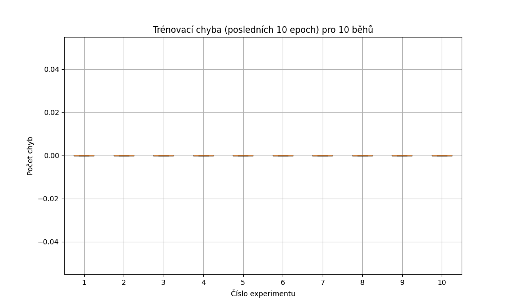

# Záznam do deníku – Perceptron a Iris dataset

## Popis úlohy
Cílem bylo implementovat jednoduchý perceptron a vyzkoušet jeho schopnosti při binární klasifikaci dat z veřejného datasetu **Iris**. Zaměřili jsme se pouze na rozlišení druhu *setosa* (třída 0) proti ostatním druhům (binární klasifikace).

## Parametry trénování
- Dataset: [Iris (UCI)](https://archive.ics.uci.edu/dataset/53/iris)
- Počet trénování: **10**
- Počet epoch: **100**
- Learning rate: **0.1**
- Aktivace: `step function` (0/1)
- Rozdělení dat: `80 %` trénink, `20 %` test
- Normalizace vstupů: `StandardScaler()`

## Výsledky experimentu
- Nejlepší model byl získán při běhu č. **0**
- Přesnost na testovací množině: **100.0%**
- Váhy nejlepšího modelu:
```python
[-0.19698594, -0.70267971, 0.58297209, -0.63457697, -0.11007498]
```

### Boxplot trénovacích chyb (posledních 10 epoch)

