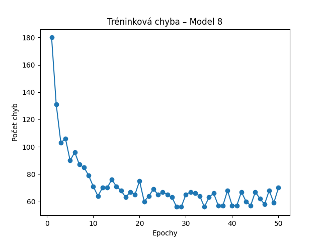
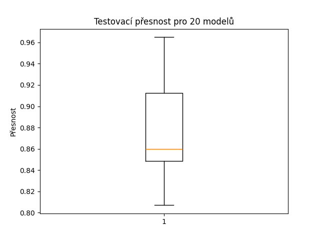

# Experimenty s perceptronem

## Popis úlohy
Cílem experimentu je trénovat jednoduchý perceptron s aktivační funkcí, která vrací **-1** pokud je potenciál menší než 0, a **1** jinak, na datasetu **Breast Cancer** načteného pomocí scikit-learn. Provedeno bylo 10 tréninkových běhů se stejnými parametry. Byl zaznamenán průběh tréninkové chyby, uloženy hodnoty vah a biasu a následně vyhodnocena testovací přesnost.

## Parametry trénování
- Počet epoch: 50
- Koeficient rychlosti učení: 0.05
- Počet běhů: 20

## Výsledky
### Testovací přesnosti jednotlivých modelů:
- Model 1: 0.9122807017543859
- Model 2: 0.8596491228070176
- Model 3: 0.8508771929824561
- Model 4: 0.9122807017543859
- Model 5: 0.8596491228070176
- Model 6: 0.9122807017543859
- Model 7: 0.8245614035087719
- Model 8: 0.9649122807017544
- Model 9: 0.9122807017543859
- Model 10: 0.8157894736842105
- Model 11: 0.9122807017543859
- Model 12: 0.9122807017543859
- Model 13: 0.8157894736842105
- Model 14: 0.9122807017543859
- Model 15: 0.8070175438596491
- Model 16: 0.8596491228070176
- Model 17: 0.8596491228070176
- Model 18: 0.8421052631578947
- Model 19: 0.9122807017543859
- Model 20: 0.8596491228070176

### Nejlepší model: Model 8
### Vizualizace

