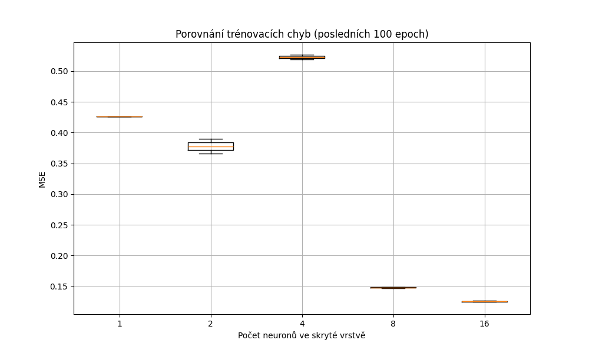
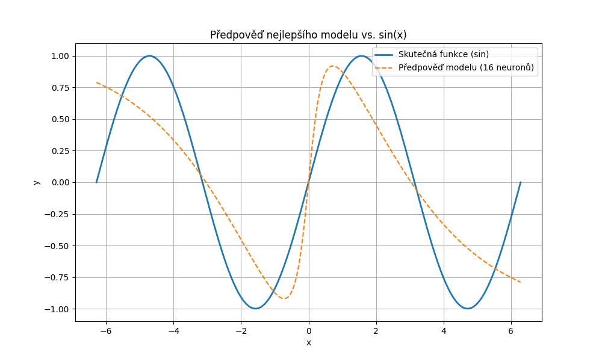

# Experiment 02
# Záznam do deníku – Trénování neuronové sítě na funkci `sin(x)`

## 🧠 Popis úlohy
Cílem bylo natrénovat jednoduchou plně propojenou neuronovou síť pro aproximaci matematické funkce:
```
f(x) = sin(x)
```
Síť měla jednu skrytou vrstvu s proměnlivým počtem neuronů. Výstupní vrstva byla lineární.

## ⚙️ Parametry trénování
- Vstupní vrstva: 1 neuron
- Výstupní vrstva: 1 neuron
- Aktivační funkce: `tanh` (skrytá vrstva)
- Počet epoch: `1000`
- Learning rate: `0.01`
- Ztrátová funkce: `Mean Squared Error (MSE)`
- Trénovací data: `200 bodů` rovnoměrně rozložených na intervalu `[-2π, 2π]`

## 🔬 Experiment: Počet neuronů ve skryté vrstvě
Provedli jsme experiment s následujícími velikostmi skryté vrstvy:
```
[1, 2, 4, 8, 16]
```
Pro každý model jsme zaznamenali průběh trénovací chyby a finální MSE.

## 📊 Výsledky

### Trénovací chyba (MSE) – posledních 100 epoch:


### Nejlepší model
- Počet neuronů ve skryté vrstvě: **16**
- Finální trénovací chyba (MSE): **0.1247**

### Porovnání výstupu nejlepšího modelu s funkcí `sin(x)`:


## 💾 Hodnoty modelu
Model uložen do souboru: `model_hidden_16.npz`

---

*Záznam vygenerován: 2025-03-30 19:02:24*
