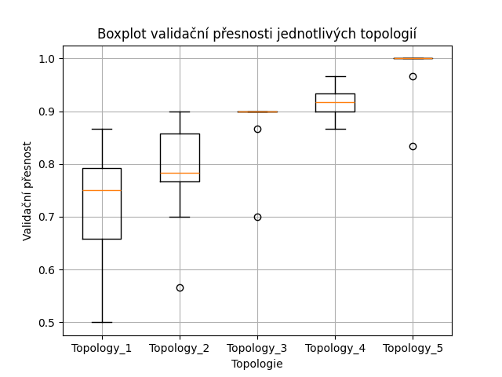

# Záznam do deníku – Tvorba FFNN pomocí Keras (sekvenční model)

## Zadání
- Seznámení se s tvorbou dopředné neuronové sítě (Feedforward Neural Network – FFNN) pomocí sekvenčního modelu v Keras.
- Návrh více topologií a jejich vyhodnocení na klasifikační úloze.
- Experimentování se stabilitou trénování pomocí více běhů.
- Vyhodnocení nejlepšího modelu.

---

## Úloha
- Byla použita klasifikační úloha rozpoznávání květin pomocí datasetu Iris.
- Úkolem bylo klasifikovat vzorek do jedné ze tří tříd na základě čtyř numerických atributů.

---

## Příprava dat
- Dataset Iris byl normalizován pomocí `StandardScaler`.
- Cílové hodnoty byly zakódovány pomocí `LabelBinarizer` (one-hot encoding).
- Data byla rozdělena na:
  - 60 % trénovací sada
  - 20 % validační sada
  - 20 % testovací sada

---

## Topologie modelů
Pět různých FFNN architektur:

| Topologie | Popis |
|:----------|:------|
| Topology_1 | 8 neuronů → výstupní vrstva |
| Topology_2 | 16 neuronů → 8 neuronů → výstupní vrstva |
| Topology_3 | 32 neuronů → 16 neuronů → 8 neuronů → výstupní vrstva |
| Topology_4 | 64 neuronů → 32 neuronů → 16 neuronů → 8 neuronů → výstupní vrstva |
| Topology_5 | 128 neuronů → 64 neuronů → 32 neuronů → 16 neuronů → 8 neuronů → výstupní vrstva |

Každá architektura byla trénována 10krát pro stabilizaci vlivu náhodné inicializace vah.

---

## Výsledky

- Pro každou topologii byla zaznamenána validační přesnost.
- Výsledky jsou zobrazeny pomocí boxplotu:

---

## Nejlepší model

- Nejlepší výsledky dosáhla topologie **Topology_5**.
- Nejlepší model byl natrénován na trénovacích datech a ověřen na testovací sadě.

**Výsledky na testovacích datech:**
- **Test Loss:** 0.0544
- **Test Accuracy:** 0.9667

---

## Závěr
- Složitější topologie s více vrstvami dosahují lepších výsledků na této klasifikační úloze.
- Testovací přesnost 96,67 % ukazuje velmi dobré naučení modelu.
- Pro menší dataset Iris byla dostačující i jednoduchá FFNN architektura.
- Pro trénink byl použit CPU, což bylo pro rozsah úlohy dostatečné.

---
