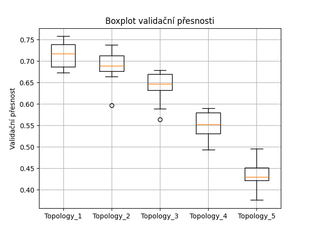
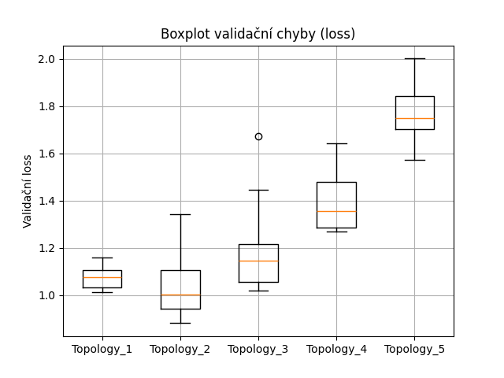

# Experiment 04 – Trénink FFNN na GTSRB datasetu (PyTorch)

## Zadání
- Seznámení s tvorbou dopředné neuronové sítě (Feedforward Neural Network – FFNN) v PyTorch.
- Návrh, trénování a vyhodnocení 5 různých architektur na klasifikační úlize (GTSRB).
- Trénování každé architektury 10× pro vyrovnání vlivu náhodnosti.
- Vyhodnocení přesnosti a ztráty pomocí boxplotů.
- Vyhodnocení nejlepší topologie na testovacích datech.

## Parametry experimentu
- Dataset: GTSRB (German Traffic Sign Recognition Benchmark)
- Framework: PyTorch 2.7.0
- Batch size: 128
- Epochs: 10
- Počet běhů každé topologie: 10

## Použité architektury (topologie)
1. [256]
2. [512, 256]
3. [1024, 512, 256]
4. [1024, 512, 256, 128]
5. [2048, 1024, 512, 256, 128]

Každá síť končí plně propojenou vrstvou na 43 výstupních tříd.

## Výsledky trénování

### Boxploty
Byly vytvořeny boxploty validační přesnosti a validační chyby (val_loss) přes 10 běhů pro každou architekturu.

**Boxplot validační přesnosti:**

**Boxplot validační chyby (loss):**

### Nejlepší model
- Nejlepší topologie na základě validační přesnosti: **[256]**

## Vyhodnocení na testovacích datech

| Metrika | Výsledek |
|:--------|:---------|
| Accuracy | 58 % |

## Pozorování
- Nejmenší síť [256] byla zároveň nejstabilnější (malý rozptyl v boxplotu) a dosáhla nejlepšího výkonu.
- Zvyšování velikosti sítě **nevedlo k lepším výsledkům**, což může být způsobeno omezenou velikostí trénovacích dat nebo přeučením větších modelů.

## Shrnutí
Experiment potvrdil, že pro GTSRB dataset a jednoduché FFNN sítě:
- menší architektura je dostatečná,
- náhodnost inicializace vah má vliv – proto bylo vhodné použít 10 běhů,
- správné nastavení batch_size a workers výrazně ovlivňuje rychlost trénování.

