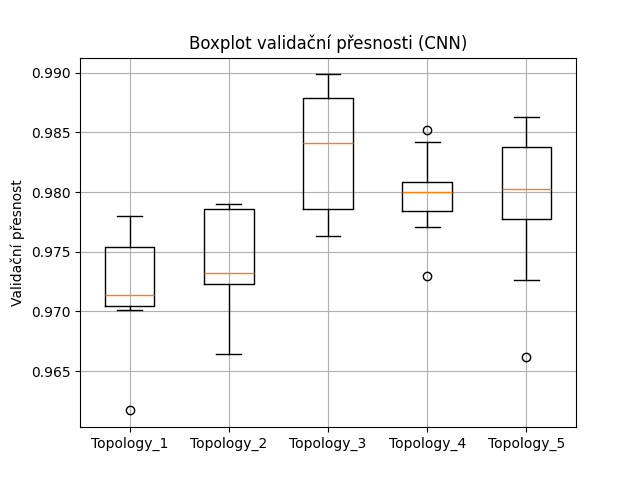
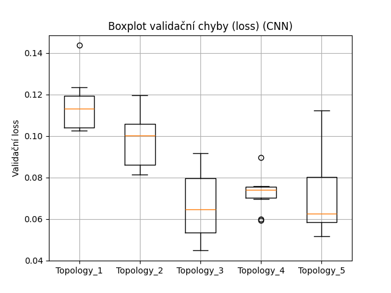
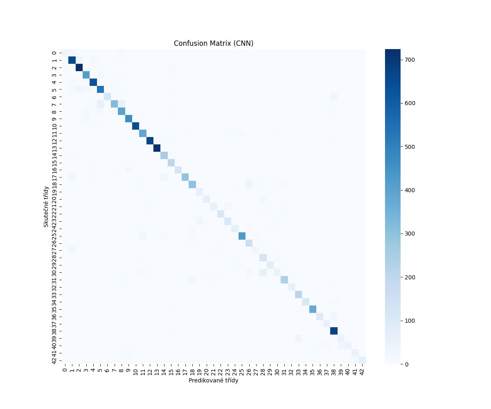

# Experiment 05 – Klasifikace dopravních značek pomocí CNN (PyTorch)

## Cíl

* Navrhnout a otestovat více vlastních architektur konvolučních neuronových sítí (CNN) pro klasifikaci dopravních značek z datasetu GTSRB.
* Porovnat jejich výkon a zvolit nejlepší model.

## Použité nástroje a knihovny

* PyTorch 2.7
* torchvision, sklearn, matplotlib, seaborn
* Dataset: GTSRB (German Traffic Sign Recognition Benchmark)

## Parametry experimentu

* Počet CNN architektur: 5
* Počet tréninků pro každou architekturu: 10 (pro vyrovnání náhodnosti)
* Epochs: 10
* Batch size: 128
* Rozměr vstupu: 32x32 RGB
* Optimalizátor: Adam (LR = 0.001)

## Architektury CNN

Každá topologie byla definována jako seznam konvolučních vrstev (filtry a velikost kernelu):

1. \[(32, 3)]
2. \[(64, 3), (32, 3)]
3. \[(128, 3), (64, 3)]
4. \[(64, 3), (128, 3), (64, 3)]
5. \[(128, 3), (128, 3), (64, 3)]

## Boxploty

Výsledky trénování 10 běhů pro každou topologii byly zaznamenány a zobrazeny v boxplot grafech:

* **Validační přesnost:**
* 
* **Validační ztráta:**
* 

## Nejlepší model

* **Topologie:** \[(128, 3), (64, 3)]
* Model byl natrénován znovu a vyhodnocen na testovacích datech.

## Výsledky na testovacích datech

|  Metrika | Výsledek |
| -------: | -------: |
| Accuracy | **89 %** |

### Klasifikační report

* `macro avg`: precision 0.86, recall 0.82, f1-score 0.83
* `weighted avg`: precision 0.89, recall 0.89, f1-score 0.88

### Pozorování

* Model vykazuje vysokou přesnost v nejfrekventovanějších třídách.
* Výrazně lepší než FFNN z předchozích experimentů.
* I slabě zastoupené třídy (např. třída 0 nebo 30) byly klasifikovány překvapivě dobře.

### Confusion Matrix

## Shrnutí

* CNN sítě dosahují o poznání vyšší přesnosti než jednoduché dopředné sítě (FFNN).
* Výsledky potvrzují efektivitu konvolučních vrstev při klasifikaci obrazových dat.
* Pro dataset GTSRB se jako nejlepší osvědčila středně hluboká síť \[(128, 3), (64, 3)].
* Experiment proběhl úspěšně a všechna data byla správně uložena.
